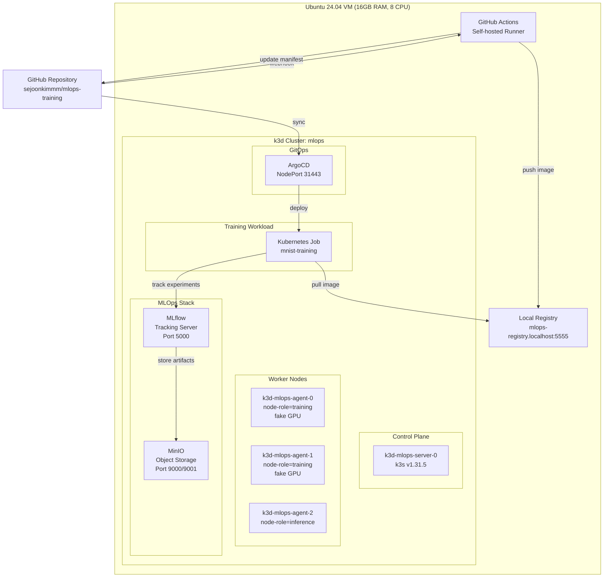
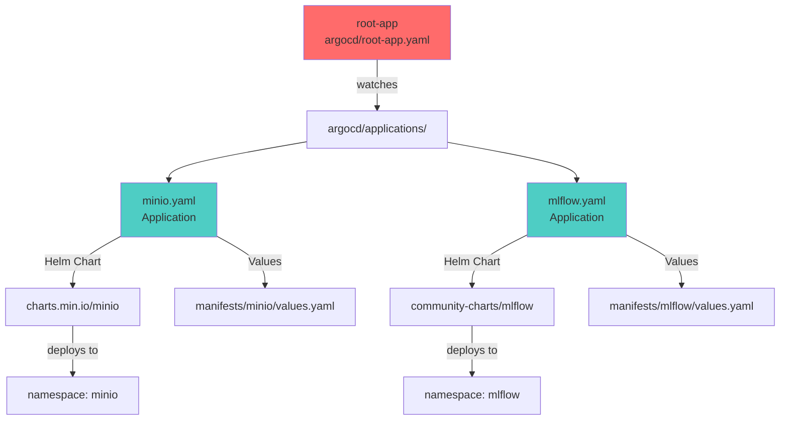
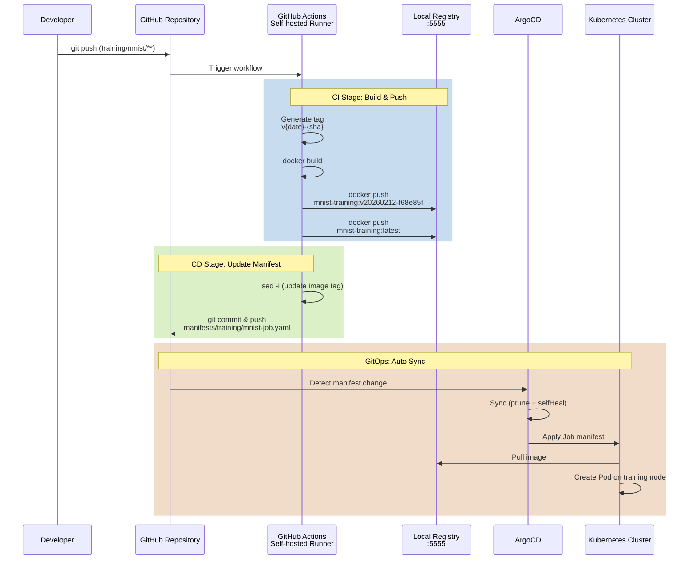
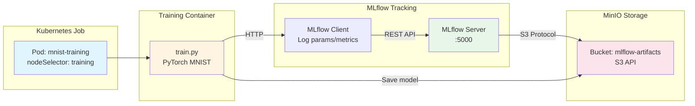

# MLOps Training Platform

An MLOps learning project that builds a k3d-based Kubernetes cluster on a single VM. It uses GitOps, CI/CD, experiment tracking, and model training pipelines.

## Overall architecture



## Technology stack

| Area | Technology | Version | Purpose |
|------|------|------|------|
| **Container Orchestration** | k3d | latest | Local Kubernetes cluster |
| | k3s | v1.31.5-k3s1 | Lightweight Kubernetes distribution |
| **GitOps** | ArgoCD | latest | Declarative deployment automation |
| **CI/CD** | GitHub Actions | - | Image build and deployment pipeline |
| **Container Registry** | k3d registry | - | Local container image registry |
| **Experiment Tracking** | MLflow | community chart 0.* | Experiment tracking and model management |
| **Object Storage** | MinIO | official chart 5.* | S3-compatible artifact storage |
| **ML Framework** | PyTorch | latest | Deep learning model training |
| **GPU Simulation** | NVIDIA k8s-device-plugin | latest | Fake GPU resource allocation |

## Infrastructure configuration

### k3d cluster details

**Cluster topology:**
- Cluster name: `mlops`
- Node configuration: 1 server + 3 agents
- Kubernetes version: v1.31.5-k3s1

**Node roles and labels:**

| Node | Role | Label | GPU | Purpose |
|------|------|--------|-----|------|
| k3d-mlops-server-0 | Control Plane | - | - | API Server, Scheduler, Controller |
| k3d-mlops-agent-0 | Worker | `node-role=training` | fake GPU | Model training workload |
| k3d-mlops-agent-1 | Worker | `node-role=training` | fake GPU | Model training workload |
| k3d-mlops-agent-2 | Worker | `node-role=inference` | - | Model serving workload (planned) |

**Port mappings:**
- `8080:80` - HTTP Ingress
- `8443:443` - HTTPS Ingress
- `31443:31443` - ArgoCD UI
- `5000:5000` - MLflow UI
- `9001:9001` - MinIO Console

**Shared volumes:**
- `/tmp/k3d-mlops/data` → `/data` (dataset storage)
- `/tmp/k3d-mlops/models` → `/models` (model files)
- `/tmp/k3d-mlops/experiments` → `/experiments` (experiment results)

**Local registry:**
- Name: `mlops-registry.localhost`
- Port: `5555`
- Access: `mlops-registry.localhost:5555`

### Fake GPU setup

The NVIDIA device plugin was modified to simulate GPU resource scheduling since there's no actual GPU.

- Target nodes: `agent-0`, `agent-1` (node-role=training)
- Resource type: `nvidia.com/gpu`
- Allocation: 1 per node
- Purpose: Testing GPU-based workload scheduling

## GitOps structure

### App of Apps pattern

All applications use ArgoCD's App of Apps pattern.



**root-app configuration:**
- Repository: `https://github.com/sejoonkimmm/mlops-training.git`
- Path: `argocd/applications`
- Sync Policy: `automated` (prune + selfHeal)

**Child applications:**

1. **MinIO** (`argocd/applications/minio.yaml`)
   - Chart: `https://charts.min.io/` (official)
   - Version: `5.*`
   - Namespace: `minio`
   - Mode: standalone (single instance)
   - Buckets: `mlflow-artifacts`, `model-registry`, `datasets`
   - Credentials: `admin` / `minio123!`

2. **MLflow** (`argocd/applications/mlflow.yaml`)
   - Chart: `https://community-charts.github.io/helm-charts`
   - Version: `0.*`
   - Namespace: `mlflow`
   - Backend Store: SQLite (`/mlflow/mlflow.db`)
   - Artifact Store: S3 (MinIO) - `s3://mlflow-artifacts`

## CI/CD pipeline

### Pipeline flow



### CI stage: Build & push image

**Trigger conditions:**
```yaml
on:
  push:
    branches: [main]
    paths:
      - 'training/mnist/**'
```

**Image tag generation:**
```bash
TAG="v$(date +%Y%m%d)-${GITHUB_SHA::7}"
# Example: v20260212-f68e85f
```

**Build and push:**
```bash
docker build -t mlops-registry.localhost:5555/mnist-training:v20260212-f68e85f training/mnist/
docker push mlops-registry.localhost:5555/mnist-training:v20260212-f68e85f
docker push mlops-registry.localhost:5555/mnist-training:latest
```

### CD stage: Update manifest & deploy

**Manifest update:**
```bash
sed -i "s|image: .*mnist-training:.*|image: ${NEW_IMAGE}|" manifests/training/mnist-job.yaml
git add manifests/training/mnist-job.yaml
git commit -m "cd: update mnist-training image to v20260212-f68e85f"
git push
```

**ArgoCD auto sync:**
- Sync policy: `automated`
- Prune: `true` (removes deleted resources)
- Self heal: `true` (recovers from manual changes)

## Training pipeline

### MNIST model training



### Model architecture

**MNISTNet (PyTorch):**
```python
Input: 28x28 grayscale image
  ↓
Flatten: 784
  ↓
Linear(784 → 128) + ReLU + Dropout(0.2)
  ↓
Linear(128 → 64) + ReLU + Dropout(0.2)
  ↓
Linear(64 → 10)
  ↓
Output: 10 classes (digits 0-9)
```

**Training parameters:**
- Optimizer: Adam
- Learning Rate: 0.001
- Batch Size: 64
- Epochs: 5 (default)
- Loss: CrossEntropyLoss

**Performance:**
- Parameter count: ~101,770
- Training time: ~2-3 minutes (CPU)
- Test Accuracy: ~97.7%

### MLflow integration

**Tracked items:**

1. **Parameters:**
   - epochs, batch_size, learning_rate
   - optimizer, device, model_params

2. **Metrics (per epoch):**
   - train_loss, train_accuracy
   - test_loss, test_accuracy

3. **Artifacts:**
   - PyTorch model (`.pth`)
   - Model metadata

**Environment variables:**
```yaml
MLFLOW_TRACKING_URI: http://mlflow.mlflow.svc.cluster.local:5000
MLFLOW_S3_ENDPOINT_URL: http://minio.minio.svc.cluster.local:9000
AWS_ACCESS_KEY_ID: admin
AWS_SECRET_ACCESS_KEY: minio123!
```

### Job execution

**Manual execution:**
```bash
kubectl apply -f manifests/training/mnist-job.yaml
```

**Check logs:**
```bash
kubectl logs -n training -l app=mnist-training -f
```

**Access MLflow UI:**
```bash
# Port forwarding
kubectl port-forward -n mlflow svc/mlflow 5000:5000

# Open http://localhost:5000 in browser
```

## Quick start

### Prerequisites

- Ubuntu 24.04 (or similar Linux distribution)
- Minimum 16GB RAM, 8 CPU
- Docker installed
- Internet connection

### Full installation

```bash
# 1. Clone repository
git clone https://github.com/sejoonkimmm/mlops-training.git
cd mlops-training

# 2. Run full installation script (dependencies + cluster + ArgoCD + fake GPU)
bash scripts/00-setup-all.sh

# 3. Deploy ArgoCD root-app
kubectl apply -f argocd/root-app.yaml

# 4. Wait for application sync (2-3 minutes)
kubectl get applications -n argocd -w

# 5. Verify MLflow and MinIO
kubectl get pods -n mlflow
kubectl get pods -n minio
```

### Individual installation steps

```bash
# 1. Install dependencies (k3d, kubectl, helm, argocd CLI)
bash scripts/01-install-deps.sh

# 2. Create k3d cluster
bash scripts/02-create-cluster.sh

# 3. Install ArgoCD
bash scripts/03-install-argocd.sh

# 4. Install fake GPU plugin
bash scripts/04-install-fake-gpu.sh
```

### ArgoCD access

```bash
# Get initial admin password
kubectl -n argocd get secret argocd-initial-admin-secret -o jsonpath="{.data.password}" | base64 -d

# Access UI: https://localhost:31443
# Username: admin
# Password: (password from above)
```

### Run training job

```bash
# Create Job
kubectl apply -f manifests/training/mnist-job.yaml

# Check logs
kubectl logs -n training -l app=mnist-training -f

# Check Job status
kubectl get jobs -n training
kubectl get pods -n training
```

## Directory structure

```
mlops-training/
├── .github/
│   └── workflows/
│       └── train-cicd.yaml          # CI/CD pipeline definition
├── argocd/
│   ├── root-app.yaml                # App of Apps root
│   └── applications/
│       ├── minio.yaml               # MinIO Application
│       └── mlflow.yaml              # MLflow Application
├── infrastructure/
│   └── k3d-cluster.yaml             # k3d cluster configuration
├── manifests/
│   ├── minio/
│   │   └── values.yaml              # MinIO Helm values
│   ├── mlflow/
│   │   └── values.yaml              # MLflow Helm values
│   └── training/
│       └── mnist-job.yaml           # MNIST training Job
├── scripts/
│   ├── 00-setup-all.sh              # Full installation script
│   ├── 01-install-deps.sh           # Install dependencies
│   ├── 02-create-cluster.sh         # Create cluster
│   ├── 03-install-argocd.sh         # Install ArgoCD
│   └── 04-install-fake-gpu.sh       # Install fake GPU
├── training/
│   ├── mnist/
│   │   ├── train.py                 # PyTorch training script
│   │   ├── Dockerfile               # Training image
│   │   └── requirements.txt         # Python dependencies
│   └── workflows/                   # (planned) Argo Workflows
├── model-serving/                   # (planned) Model serving
└── README.md
```

## Remaining tasks

### Phase 4: Continuous training (in progress)

- [ ] Schedule daily training with CronJob
- [ ] MLflow Model Registry integration
  - [ ] Model version management (Staging, Production)
  - [ ] Model performance comparison and auto-promotion
- [ ] Training data version control (DVC or MinIO versioning)
- [ ] Training failure notifications (Slack/Discord webhook)

### Phase 5: Monitoring & observability (planned)

- [ ] Install Prometheus + Grafana
  - [ ] Cluster resource monitoring
  - [ ] MLflow metrics collection
- [ ] Training Job metrics dashboard
- [ ] Model performance trend visualization
- [ ] Log collection (Loki or ELK)

### Phase 6: Model serving (planned)

- [ ] Install KServe or Seldon Core
- [ ] MNIST model REST API serving
- [ ] Use inference node (agent-2)
- [ ] A/B testing and Canary deployment
- [ ] Inference performance monitoring

### Additional improvements

- [ ] Build complex training pipelines with Argo Workflows
- [ ] Try Kubeflow Pipelines integration
- [ ] Multi-model training (CIFAR-10, ImageNet subset)
- [ ] Hyperparameter tuning (Optuna + MLflow)
- [ ] Migration guide for real GPU environments

## References

- **Repository:** https://github.com/sejoonkimmm/mlops-training
- **k3d Documentation:** https://k3d.io/
- **ArgoCD Documentation:** https://argo-cd.readthedocs.io/
- **MLflow Documentation:** https://mlflow.org/docs/latest/
- **MinIO Documentation:** https://min.io/docs/

---

**Author:** Sejoon Kim  
**Purpose:** MLOps learning and portfolio  
**Environment:** Ubuntu 24.04, 16GB RAM, 8 CPU, No GPU  
**Last Updated:** 2026-02-12
